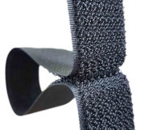
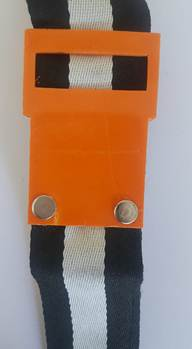
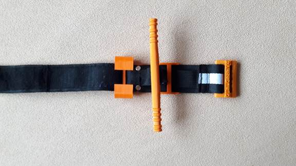

# Список матеріалів
* Стрічка самоклеюча (липучка) чорна [ширина 4 см] на перед пояса
* Стрічка самоклеюча (липучка) біла [ширина 2 см] для кліпси.
* Бавовняна та поліефірна тасьма шириною 4 см для задньої частини ременя.
* Нейлоновий міцний ремінь, що не розтягується [ширина 2,5 см] для внутрішнього ременя.
* Подвійні заклепки з головкою 7 мм
* Поліестрова нитка [товщина 0,75 мм] для зшивання деталей пояса.
* Суперклей.
* 3D друковані компоненти.

Примітка. Замість окремих шматочків липучки можна використовувати один шматок самоклеючої стрічки.

# Дії зі збирання
Відріжте ремені необхідної довжини, а саме:
 * Чорна самоклеюча стрічка-липучка (груба частина: 3 шт. по 6 см і 1 шт. 15 см, м'яка частина: 1 шт. 6 см, 2 шт. 12,5 см кожна, 1 шт. 19 см)
 * Біла стрічка, що самоклеїться на липучці (груба частина: 1 шт. 20 см, м'яка частина: 1 шт. 20 см)
 * Ремінь з бавовни та поліестеру (одна деталь довжиною 97 см)
 * Товста нейлонова лямка (одна частина довжиною 97 см)

2. Щоб сформувати передню частину пояса, пришийте підготовлені вами чорні стрічки (липучки) один до одного в наступній послідовності [ 6 см тонка, 6 см груба, 12,5 см тонка, 6 см груба, 12,5 см гладка, 6 см груба, 19 см тонка, 15 см груба]. Прошейте кожен сполучний шов двома проходами для збільшення міцності на розрив.

3. Зшийте перед поясом з виворотом тільки з одного боку, залиште інший бік відкритим, щоб вставити внутрішній пояс.

4. Вставте внутрішній ремінь між передньою та задньою частинами ременя, а потім зшийте кінець ременя з переднім та заднім ременями. Повторіть цей процес кілька разів, щоб стібки були зигзагоподібними та знаходилися на відстані до 5 см від краю пояса.

5. Зшийте передню частину ременя із задньою частиною іншої сторони, пам'ятаючи, що внутрішній ремінь повинен бути осторонь місця зшивання, щоб він міг вільно рухатися.

6. Виконайте два отвори у верхній частині лицьової сторони ременя.

7. Використовуйте заклепку, щоб закріпити опорний кронштейн із ременем через отвори.

8. Вставте ремінь через отвори пряжки, поки він не досягне опорної пластини, зважаючи на те, що широка відкрита область пряжки знаходиться ближче до кінця ременя, як показано на малюнку.

9. Вставте внутрішній ремінець через отвір для палиці. Потім вставте ремені через проріз опорного кронштейна.

10. Потягніть стрижень у бік пряжки, щоб зберегти додаткову довжину внутрішнього ременя в цій області, оскільки це необхідно в процесі затягування.

11. Пропустіть верхні кінці ременя через беззубчастий отвір пряжки, загніть вгору і знову пришийте ще й ременя. Повторіть процес шиття кілька разів.

12. Видаліть усі зайві нитки.

13. Обріжте край ременя овальної форми. Прогладьте кінець ременя, щоб його було легко вставити в пряжку.

14. SПришийте білу грубу самоклеючу стрічку-липучку до центру тонкої стрічки, щоб вийшов ремінець із пряжкою. Зверніть увагу, що час початку вказано за допомогою ремінця для зупинки кровотечі на цьому ремінці.

15. Прикріпіть пряжку ременя до пряжки суперклеєм.

